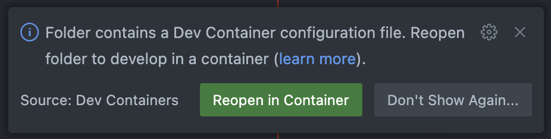

## About Me

:::: {style="font-size: 50%;"}
:::: {layout="[0.20, -0.025, 0.375, 0.40]" layout-valign="center"}
{.picture}

:::: {}
- [ mickael.canouil.fr](https://mickael.canouil.fr/){style="text-decoration: none;"}
- [ pro@mickael.canouil.dev](mailto:pro@mickael.canouil.dev){style="text-decoration: none;"}
- [ \@mcanouil](https://github.com/mcanouil/){style="text-decoration: none;"}
- [ mickaelcanouil](https://www.linkedin.com/in/mickaelcanouil/){style="text-decoration: none;"}
:::

:::: {}
- [ \@mickael.canouil.fr](https://bsky.app/profile/mickael.canouil.fr/){style="text-decoration: none;"}
- [ \@MickaelCanouil\@fosstodon.org](https://fosstodon.org/@MickaelCanouil/){style="text-decoration: none;"}
- [ \@MickaelCanouil](https://x.com/MickaelCanouil/){style="text-decoration: none;"}
:::

:::
:::

:::: {style="font-size: 55%; font-style: italic;"}

- I am Mickaël CANOUIL, I hold a Ph.D. in Biostatistics, with over a decade of academic experience in the genetics of type 2 diabetes and obesity.
- My research has contributed to understanding the genetic and molecular mechanisms underlying metabolic diseases, with publications in leading journals.
- Currently, I work as a consultant in biostatistics, applying my expertise to diverse projects in multi-omics and data analysis.
- I am also deeply involved in the Quarto ecosystem, developing extensions and tools that enhance reproducibility and scientific communication.
- My contributions, including [Quarto Wizard](https://github.com/mcanouil/quarto-wizard) and [various Quarto extensions](https://m.canouil.dev/quarto-extensions/authors/mcanouil.html), aim to streamline workflows for researchers and data scientists.
- You can explore my work on [GitHub](https://github.com/mcanouil), my [projects](https://mickael.canouil.fr/projects), and my [publications](https://mickael.canouil.fr/publications).

:::

# Introduction to Dev Containers {.center-x}



## What Are Dev Containers?

:::: {.incremental}

- [ Dev Containers](https://containers.dev/) allow developers to work inside a predefined, isolated environment.

- By leveraging [ Docker](https://www.docker.com/), they provide a consistent and repeatable setup, removing "*it works on my machine*" issues.

- They integrate seamlessly with [Visual Studio Code](https://code.visualstudio.com/) and [ GitHub Codespaces](https://github.com/features/codespaces), enabling developers to code, build, and debug inside the container while using their familiar tools.

:::

## Why Use Dev Containers?

:::: {.incremental}

- Developers often face challenges in maintaining consistency across various systems.

- Imagine working with a  Python project that requires specific dependencies.
One developer may have version conflicts, another may struggle with installation.

- Dev Containers solve this by ensuring each team member uses the exact same environment, reducing debugging time and improving workflow efficiency.

:::

# Understanding Dev Containers {.center-x}



## How Dev Containers Work {#how-dev-containers-work-1}

:::: {.fragment fragment-index="1"}

Rather than installing dependencies manually, developers define their development environment inside a `.devcontainer` directory in their  Git repository.

:::

:::: {.fragment fragment-index="2"}

```sh
.devcontainer
└── devcontainer.json
```

:::

:::: {.fragment fragment-index="3"}

This configuration directory instructs Docker to create a workspace that includes all necessary tools and settings.

:::

## How Dev Containers Work {#how-dev-containers-work-2}

[A typical workflow:]{.fragment fragment-index="1"}

1. [Developer opens a project in Visual Studio Code.]{.fragment fragment-index="2"}
2. [VS Code detects the presence of a `.devcontainer` configuration.]{.fragment fragment-index="3"}
3. [The container is built and launched, ready for coding.]{.fragment fragment-index="4"}

:::: {.fragment fragment-index="5"}

{fig-align="center" fig-alt='A notification from a Visual Studio Code indicates that the folder contains a Dev Container configuration file. The message suggests reopening the folder to develop in a container and provides a link to learn more. There are two buttons: "Reopen in Container" in green and "Don\'t Show Again..." in gray. The source of the notification is the "Dev Containers" extension.'}

:::

## Prerequisites

[Before diving into Dev Containers, ensure:]{.fragment fragment-index="1"}

- [**Visual Studio Code** is installed and up to date.]{.fragment fragment-index="2"}
- [**Docker** is running ([Docker Desktop](https://www.docker.com/products/docker-desktop/) or another compatible solution).]{.fragment fragment-index="3"}
- [[**Dev Containers Extension**](https://marketplace.visualstudio.com/items?itemName=ms-vscode-remote.remote-containers) is added to VS Code.]{.fragment fragment-index="4"}


# Setting Up`<br>`{=html}Dev Containers {.center-x}



## Creating a Dev Container

[Let's get started! To create a Dev Container, follow these steps:]{.fragment fragment-index="1"}

1. [Open your project in VS Code.]{.fragment fragment-index="2"}
2. [Use the **Command Palette** and search for "*Dev Containers: Add Dev Container Configuration Files...*".]{.fragment fragment-index="3"}
3. [Choose an appropriate template for your stack (Node.js, Python, Rust, etc.).]{.fragment fragment-index="4"}
4. [Your project now contains a `.devcontainer/devcontainer.json` file.]{.fragment fragment-index="5"}

[Editing this file allows further customisation.]{.fragment fragment-index="6"}

## Example `devcontainer.json`

Consider a simple [Quarto CLI](https://quarto.org/) setup:

```{.json code-line-numbers="|3|8|9|"}
{
  "name": "My Dev Container",
  "image": "ghcr.io/mcanouil/quarto-codespaces:latest", // <1>
  "remoteUser": "vscode",
  "customizations": {
    "vscode": {
      "extensions": [
        "quarto.quarto", // <2>
        "mcanouil.quarto-wizard" // <3>
      ]
    }
  }
}
```

1. The Docker image is specified in the `image` field.
   It's built using a Dev Container specification that you can find in [`.github/.devcontainer`](https://github.com/mcanouil/quarto-codespaces/tree/main/.github/.devcontainer).
2. The [`quarto` extension](https://github.com/quarto-dev/quarto) for Visual Studio Code / Positron to provide support for Quarto documents.
3. The [`quarto-wizard` extension](https://github.com/mcanouil/quarto-wizard) for Visual Studio Code / Positron to provide assistance in managing Quarto extensions

## Customising Your Environment

A basic setup may be sufficient, but advanced users often refine their environment:

```{.json code-line-numbers="|5-8|10-12|"}
{
  "name": "My Dev Container",
  "image": "ghcr.io/mcanouil/quarto-codespaces:latest",
  "remoteUser": "vscode",
  "features": { // <1>
    "ghcr.io/devcontainers/features/docker-in-docker:2": {},
    "ghcr.io/devcontainers/features/github-cli:1": {}
  },
  "customizations": {
    "settings": { // <2>
      "r.rterm.option": [ "--no-save", "--no-restore-data", "--quiet"]
    },
    "vscode": {
      "extensions": ["quarto.quarto", "mcanouil.quarto-wizard"]
    }
  }
}
```

1. **Features**: This section allows you to add [pre-defined features](https://containers.dev/features) to your container, such as **Docker-in-Docker** or the **GitHub CLI**.
2. **Settings**: Custom Visual Studio Code settings can be defined here, such as R options.

# Building and Running`<br>`{=html}the Dev Container {.center-x}



## Visual Studio Code

[Once the configuration is set, building and running the container is straightforward:]{.fragment fragment-index="1"}

1. [Open the **Command Palette** and select "*Dev Containers: Reopen in Container*".]{.fragment fragment-index="2"}
2. [VS Code will build the container based on the configuration.]{.fragment fragment-index="3"}
3. [Once built, the container will launch, and you can start coding.]{.fragment fragment-index="4"}

## GitHub Codespaces

[For those using GitHub Codespaces, the process is similar:]{.fragment fragment-index="1"}

1. [Open your repository on GitHub.]{.fragment fragment-index="2"}
2. [Click on the green "*Code*" button and select "*Open with Codespaces*".]{.fragment fragment-index="3"}
3. [GitHub will automatically build the Dev Container based on the configuration.]{.fragment fragment-index="4"}
4. [Once the Codespace is ready, you can start coding directly in the browser.]{.fragment fragment-index="5"}

## The Dev Container CLI

:::: {.fragment fragment-index="1"}

For advanced users, the [Dev Container CLI](https://code.visualstudio.com/docs/devcontainers/devcontainer-cli) provides additional flexibility.
With simple commands, developers can build, start, and interact with their containers from the terminal.

:::


:::: {.fragment fragment-index="2"}

1. Install the CLI globally using `npm`:

   ```sh
   npm install -g @devcontainers/cli
   ```

:::

:::: {.fragment fragment-index="3"}

2. Use the CLI to build and run your Dev Container:

   ```sh
   devcontainer build --workspace-folder .
   devcontainer up --id-label name=my-container --workspace-folder .
   devcontainer exec --id-label name=my-container pwd
   ```

:::

# Live Demonstration {.center-x}

[](vscode:://file/Users/mcanouil/Projects/pro/training/devcontainer-introduction/)

# Conclusion {.center-x}



## Use Cases and Benefits

:::: {.fragment fragment-index="1"}

Picture a developer moving between machines or working remotely.
Instead of reinstalling dependencies, they simply open their project inside a pre-configured Dev Container.

:::

:::: {.fragment fragment-index="2"}

Other advantages:

:::

- [ **Remote Development:** Work on code from any system.]{.fragment fragment-index="3"}
- [ **Team Collaboration:** Share a unified development environment.]{.fragment fragment-index="4"}
- [ **Sandboxing:** Experiment with dependencies without risking the host machine.]{.fragment fragment-index="5"}
- [ **CI/CD Integration:** Ensure build reproducibility.]{.fragment fragment-index="6"}

## Summary

:::: {.fragment fragment-index="1"}

Dev Containers provide a structured, reliable development environment that simplifies onboarding and improves collaboration.  
Whether working solo or in a team, adopting containerised development ensures that everyone works inside the same, pre-configured setup.

:::

:::: {layout="[0.10, 0.80, 0.10]" style="text-align: center;" .fragment fragment-index="2"}


With Dev Containers, development becomes more predictable and efficient.
Embrace the change today!


:::

## Further Resources

:::: {layout="[0.44, -0.02, 0.44]" layout-valign="center" .center-y}

:::: {}
- [This slide deck as PDF](https://m.canouil.dev/devcontainer-introduction/devcontainer-introduction.pdf)
- [Dev Containers Overview](https://code.visualstudio.com/docs/devcontainers/containers)
- [Creating a Dev Container](https://code.visualstudio.com/docs/devcontainers/create-dev-container)
:::

:::: {}
- [Dev Containers Specification](https://containers.dev/)
- [Dev Containers Features](https://containers.dev/features)
- [GitHub Codespaces](https://docs.github.com/en/codespaces/about-codespaces/what-are-codespaces)
:::

:::


